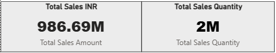

# Power BI Sales Dashboard

## 📌 Project Overview
This project presents an interactive Power BI dashboard built to analyze sales performance and key business metrics.

## 🎯 Objectives
- Track overall sales and profit
- Identify top-performing products and regions
- Analyze trends over time

## 🛠️ Tools & Technologies
- Power BI
- MySQL
- SQL
- Excel

## 📊 Key Insights
- Sales performance by region and category
- Monthly sales trends
- High-revenue products

## 🔗 Live Dashboard
[Click here to view the interactive dashboard](https://app.powerbi.com/links/6zjTi2jG7s?ctid=8090291b-ebcc-4bdf-bde1-cbacbb7c25a9&pbi_source=linkShare)

## 📷 Dashboard Preview

## 📁 Files Included
- `Sales_Dashboard.pbix` – Power BI dashboard file
- Screenshots for quick preview

## 👤 Author
**Dishambha Awasthi**
